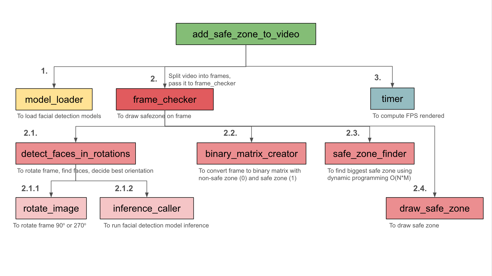
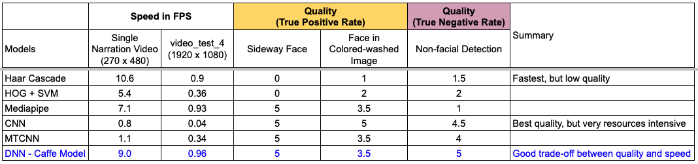

# Introduction

This work is a part of my application process for the Senior Data Scientist role at 1BStories.

## Objective

Our primary goal is to develop a model that efficiently identifies usable space within a social media safezone for a 9:16 aspect ratio vertical video. This space must not intersect with any facial regions in a video, ensuring that any added text or graphics do not obstruct viewers' faces. This capability is crucial for creating engaging and professional content that respects the viewer's experience.

## Scoring Criteria

The solution presented in this notebook has been rigorously tested for correctness, processing speed, and flexibility to cater to the 9:16 and horizontal 16:9 video format.

## Solution Strategy

In addressing the task at hand, the strategy hinges on three functions, each designed to meet specific criteria essential for the solution's success. Below is an overview of these functions and the unique challenges they aim to overcome:

### Core Functions

1. **Face Detector**: This function is crucial for identifying faces within the video. The main challenge lies in selecting a detector that not only operates efficiently but can also handle a variety of complex scenarios. These include detecting non-frontal faces, faces against a similarly colored background, faces of different sizes, and faces that may be partially obscured.
 

2. **Orientation Detector**: Stability in determining the best orientation for the video is important. The orientation detector must deliver consistent results (non-jittery) while ensuring that each video frame is processed only once (to ensure efficiency). Additionally, it is essential to translate face boundaries into coordinates that accommodate both orientations accurately.
 

3. **Biggest Safe Zone Finder**: A rule-based approach is inefficient for addressing situations with multiple faces effectively. Thus, an optimized solution is necessary to navigate the complexities of identifying the largest safe zone free from obstructions.
 

### Proposed Solution

1. **Face Detector**: It is proposed to use a DNN model that balances speed and detection quality, offering an efficient solution capable of handling the challenges. More details are provided in the analysis below.
 

2. **Orientation Detector**: By leveraging the detected faces, the orientation is determined based on the prevalence of faces in each orientation. A decay function is applied to the count of faces per orientation, giving greater weight to more recently detected faces, thereby enhancing the relevance and accuracy of the orientation determination.
 

3. **Biggest Safe Zone Finder**: Employing dynamic programming, we ensure the identification of the largest usable area is both swift and precise, significantly improving upon traditional rule-based methods.
 

### Implementation Details

Below are the Python functions developed to bring our solution to life:

1. **Face Detector**: `model_loader`, `inference_caller`
2. **Orientation Detector**: `detect_faces_in_rotations`, `FaceOrientationCounter`
3. **Biggest Safe Zone Finder**: `safe_zone_finder`

### Function Call Graph

## Facial Detection Models Comparison
| Models       | Summary                                                                                                      | Strength                  | Weaknesses                                        | Source |
|:-------------|:-------------------------------------------------------------------------------------------------------------|:--------------------------|:--------------------------------------------------|:-------|
| Haar Cascade | - Utilizes Haar wavelet-based feature (does not require multiplication, only addition) - Trained with positive and negative images - Trick: Adaboost to select facial features, Cascade of classifier to select facial region | Highly efficient          | - Not suitable for non-frontal faces - Complex background - Sensitive to lighting | [Link](https://docs.opencv.org/3.4/db/d28/tutorial_cascade_classifier.html) |
| HOG + SVM    | - Create Histogram of Gradient, split face and non-face using SVM - Detection is based on assessing HOG features across sliding window at various position and scales | Good balance between accuracy and speed/efficiency | - Not suitable for non-frontal faces - Not suitable for occlusion (blocked face) - Not suitable for low resolution image | [Link](https://github.com/mbrotos/Face-Detection-SVM-HOG) |
| Mediapipe    | - Cross-platform framework leveraging CPU and GPU                                                            | Highly efficient          | - Not as accurate relative to NN models                  | [Link](https://developers.google.com/mediapipe/) |
| CNN          | - Deep CNN which enables high accuracy at the cost of resources                                              | Highly accurate           | Computationally intensive                         |  |
| MTCNN        | - Three stages of CNN (P-Net <propose>, R-Net <refine>, O-Net <output>) - Cascading framework prevents parallel processing across stages | Highly accurate           | Computationally intensive                         | [Link](https://github.com/ipazc/mtcnn?tab=readme-ov-file#zhang2016) |
| DNN with Caffe Framework        | - Provided by OpenCV DNN Module (highly optimized, automatic used of backend resources) - Allows vectorization and parallel computing - Weighted provided by Caffe framework (designed for efficiency) | Highly accurate yet quick | Can be resource intensive as it is still a DNN    | [Link](https://caffe.berkeleyvision.org/) |

### Facial Detector Models Performance

Links to video (with facial boundaries):
- [Single Narration Video using Dlib CNN](https://drive.google.com/file/d/1bnyWP-D5bfEgsiLaR8wo7nFFElpYyiO8/view?usp=sharing) - very slow
- [Single Narration Video using DNN with Caffe Framework](https://drive.google.com/file/d/1VCdK9ZDho680DSBTUawthWMN5ykrpJ9i/view?usp=sharing) - quick
- [Horizontal Video 1](https://drive.google.com/file/d/1qDaF3rSW7vFVYUdmidumnOCC8UDileea/view?usp=sharing)
- [Horizontal Video 2](https://drive.google.com/file/d/1sLsFpVaW7KG16qj4a9s5zwtwbYcwYHt5/view?usp=sharing)

Links to video (without facial boundaries):
- [Single Narration Video using DNN with Caffe Framework](https://drive.google.com/file/d/1no5twOpIAWgzEkQ_b1Srv1-DDz6weJ8V/view?usp=sharing)
- [Horizontal Video 1](https://drive.google.com/file/d/1p7bv7j1oj8cJTfE5spYBDUoNPysZmHSe/view?usp=sharing)
- [Horizontal Video 2](https://drive.google.com/file/d/1BG9dk8Dx7ej6Qpb5m9T4--uCvu3fhBRY/view?usp=sharing)

Links to video (original videos):
- [Single Narration Video using DNN with Caffe Framework](https://drive.google.com/file/d/1xr295GsVl4ScIMZvHgfn1PnCf9XpfPnj/view?usp=sharing)
- [Horizontal Video 1](https://drive.google.com/file/d/1Z1aic1b1Degghs7D1lFz2BPtn1OvP0rS/view?usp=sharing)
- [Horizontal Video 2](https://drive.google.com/file/d/1LhLHuvWEa2yV03RcyEzb4__WZnzQkvdY/view?usp=sharing)

